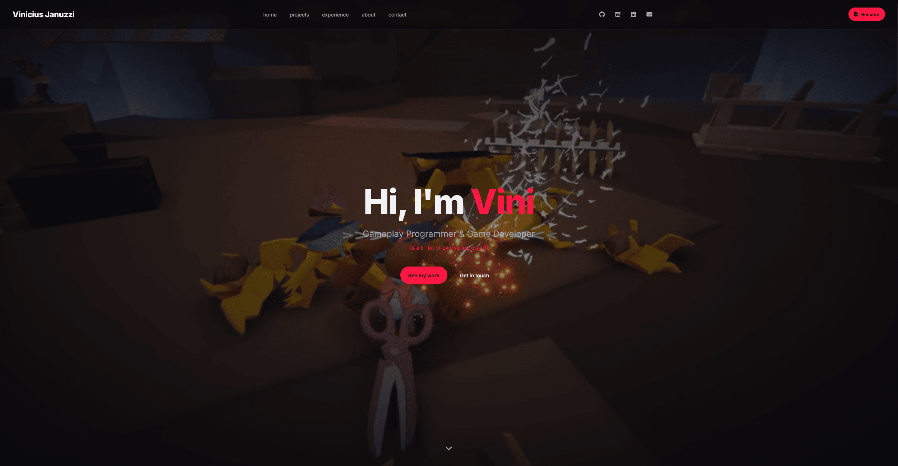
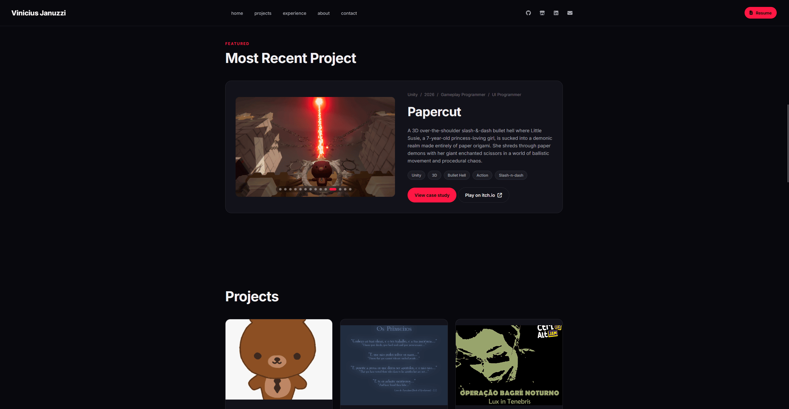
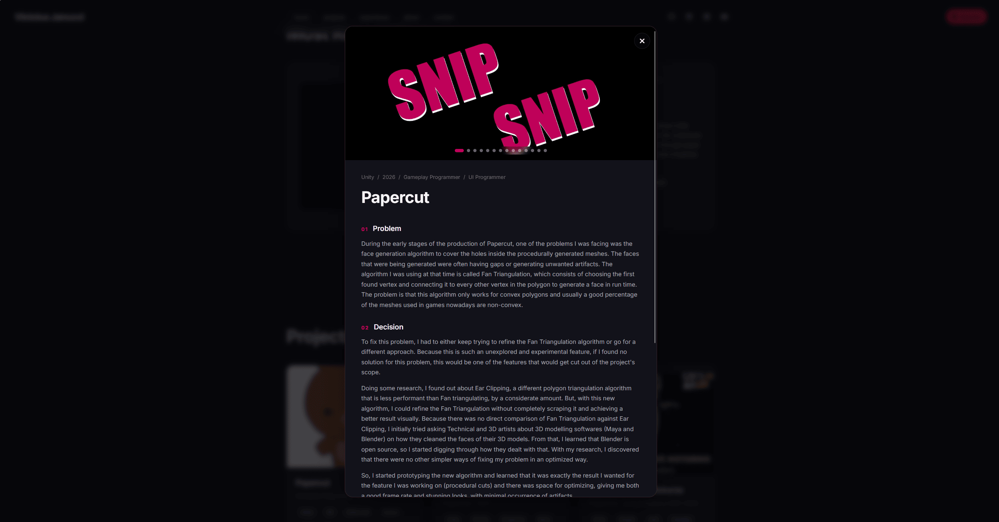

# vinicimdev.github.io

Personal portfolio for Vinicius Januzzi - gameplay engineer based in Vancouver, BC.

**Live at [vinicimdev.github.io](https://vinicimdev.github.io)**



<p align="center">
  
  
</p>

## Stack

Vanilla HTML, CSS, and JavaScript. No frameworks, no build step, no bundler, just static files served straight from GitHub Pages. All animations are pure CSS or a few lines of JS.

## Built by hand

Some pieces I wanted to write from scratch instead of pulling in a library:

- **Hero video sequencer** - three gameplay clips cycle through the hero background via a small JS listener on the `ended` event
- **Case study modal** - data-driven from a single `caseStudies` object at the bottom of `index.html`. Adding a project = adding one entry
- **Media carousel** - a shared function powers both the featured project preview (with auto-advance) and the case study modal (manual). Handles mixed images/videos, fade transitions, keyboard navigation
- **Rotating neon outline on project cards** - `conic-gradient` masked as a border, rotated via an `@property`-registered `--border-angle` custom property. Pure CSS, no JS
- **Zigzag timeline** - Experience section built with CSS grid + pseudo-elements for the center line, dots, and card notches
- **Cross-source visual language** - every orange/red-neon button shares the same shine, lift, and glow via a `background-image` gradient technique, so calibrating the whole site is a one-token change in the CSS palette variables

## Run locally

```bash
git clone https://github.com/vinicimdev/vinicimdev.github.io.git
cd vinicimdev.github.io
```

This project uses ES modules, so it needs to be served over HTTP.
Opening `index.html` directly won't work. Any local
server does the job:

**VS Code:** install the Live Server extension, then
right-click `index.html` -> "Open with Live Server".

**Python:** `python3 -m http.server 8000`, then open
http://localhost:8000

No build step, no dependencies.

## Credits

- Fonts: [Inter](https://rsms.me/inter/) via Google Fonts
- Icons: [Font Awesome](https://fontawesome.com/) 6.4
- Tech logos in project cards: [Devicon](https://devicon.dev/) via jsDelivr
- Cover art for Papercut / A22 / Operação Bagre Noturno: from the respective itch.io project pages